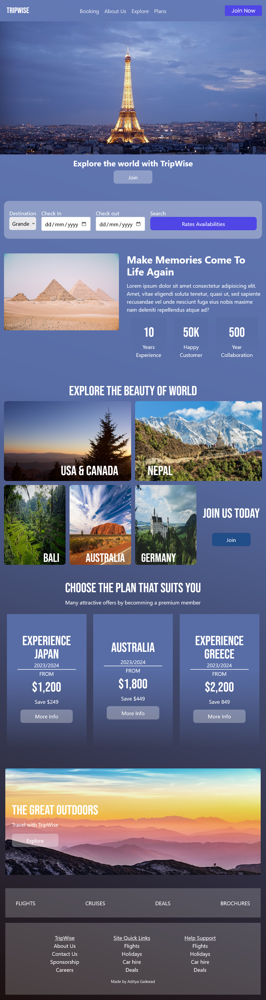

<h2>About the project</h2>

  
Welcome to Trip Wise, an innovative and user-friendly web application developed to serve as a travel agent. This README file aims to provide you with essential information about the front-end development of the Trip Wise website.

👉 Live Demo: <a href='https://trip-wise-sage.vercel.app/'>Live Demo</a>

<h2>Build with</h2>
» React JS 
» Tailwind 

<h2>Introduction</h2>

Trip Wise is a comprehensive travel agent web application designed to assist users in planning, organizing, and booking their dream vacations. The front-end of the website focuses on providing an intuitive user interface that offers an exceptional user experience, allowing visitors to browse and select from a wide range of destinations, accommodations, and activities. 

<h2>Features</h2>
<b>Responsive Design</b>

The website is built with responsive design principles to ensure optimal viewing experience across various devices and screen sizes. 

 
<b>Services</b>

Visitors can learn about the different services offered by the Fitness Zone gym, such as personal training, and group classes.

 
<h2>Screenshots of the Project</h2>

